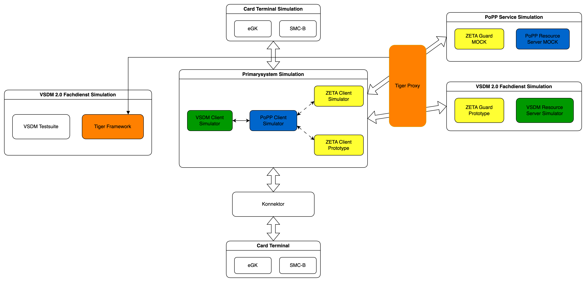

<br/>

# TI 2.0 Testhub

**NOTE:** This project is not meant to be run in production and we strongly
advise against!

The **TI 2.0 Testhub** provides a comprehensive test environment for the
modernized German Telematics Infrastructure ( TI) version 2.0. As the healthcare
telematics infrastructure undergoes significant architectural improvements, a
core aspect is the implementation of **Zero Trust Architecture (ZeTA)** security
concepts.

This project enables developers and testers to:

- **Simulate and validate** Zero Trust Architecture (ZeTA) components
- **Test PoPP** (Proof of Possession) workflows for secure authentication
- **Validate VSDM2** (Versichertenstammdatenmanagement 2.0) functionality
- **Develop and test** client applications against mock backend services
- **Understand integration patterns** for TI 2.0 ecosystem

### Table of Contents

- [Getting Started](#getting-started)
- [Usage](#usage)
- [Architecture](#architecture)
- [Configuration](#configuration)
- [Folder Structure](#folder-structure)
- [Release Notes](#release-notes)
- [Changelog](#changelog)
- [Contributing](#contributing)
- [License](#license)
- [Additional Notes And Disclaimer](#additional-notes-and-disclaimer)

# Getting started

Install required software:

- Java 21
- Docker
- Docker Compose

Then run in a shell from project root:

``` bash
./doc/bin/test-with-compose-local-rebuild.sh
```

This will:

1. compile the sources
2. build the required Docker Images
3. run `docker compose`
4. execute available test suites against the local Testhub instance

# Usage

> [!IMPORTANT]  
> Running Testhub testsuits requires a valid SMC-B certificate and key pair. Please request a test SMC-B at [gematik Anfrageportal](https://service.gematik.de/servicedesk/customer/portal/37)
> Please place them in the `doc/docker/vsdm/zeta/smcb-private` folder as follows:  `smcb_private.p12` (p12 file with AUT_E256_X509 certificate), `smcb_private.alias.txt` (alias of the smcb certificate in the p12 file, default is `alias`) and `smcb_private.pw.txt` (password of the p12 file).

After making changes to the code you can either run

``` bash
./doc/bin/docker-compose-local-rebuild.sh
```

or for more fine-grained control use

``` bash
./mvnw install -Pdocker
```

To stop all services:

```bash
./doc/bin/docker-compose-down.sh
```

## Running Tests

The Testhub includes a test suite for validating VSDM2 workflows:

```bash
cd test/vsdm-testsuite
../../mvnw verify -Dskip.inttests=false
```

## Running Tests manually

Tests are written using Cucumber and Gherkin. The files are located in `test/`.

To execute tests manually using IntelliJ:

1. Install the plugins Gherkin and Cucumber for Java.
2. [Configure IntelliJ using the Tiger manual](https://gematik.github.io/app-Tiger/Tiger-User-Manual.html#intellij)
3. Locate your desired test case and run it in IntelliJ

## Accessing Swagger UI

Most services expose Swagger UI for API exploration:

- **Card Terminal Client**: http://localhost:8000/swagger-ui/index.html
- **VSDM Client**: http://localhost:8220/swagger-ui/index.html
- **ZeTA PDP PoPP**: http://localhost:9100/swagger-ui/index.html
- **PoPP Server**: http://localhost:9120/swagger-ui/index.html
- **VSDM Server**: http://localhost:9121/swagger-ui/index.html

## Example Workflows using Curl

### 1. VSDM Data Retrieval

```bash

###### Get VSDM data through the client

curl -X GET 'http://localhost:8220/vsdm/data' \
  -H 'Authorization: Bearer <ACCESS_TOKEN>'
```

### 2. Card Terminal Operations

```bash

###### Load a card

curl -X POST 'http://localhost:8000/card/load' \
  -H 'Content-Type: application/json' \
  -d '{"cardPath": "cards/egk/valid-egk.xml"}'
```

### 3. Token Exchange (OAuth 2.0 RFC 8693)

```bash

###### Exchange SMC-B token for ZeTA token

curl -X POST 'http://localhost:9100/token' \
  -H 'Content-Type: application/x-www-form-urlencoded' \
  -d 'grant_type=urn:ietf:params:oauth:grant-type:token-exchange&subject_token=<SMC_B_TOKEN>&subject_token_type=urn:ietf:params:oauth:token-type:access_token'
```

## Debugging

You can connect to the following ports for remote Java debugging:

- Card Terminal Client: Port 5005
- VSDM Client: Port 5006
- ZeTA PEP PoPP: Port 5007
- ZeTA PDP PoPP: Port 5001
- ZeTA PDP VSDM: Port 5022
- PoPP Server: Port 5003
- VSDM Server: Port 5004

# Architecture

The Testhub implements a **Zero Trust Architecture** with multiple layers of services communicating through
authenticated channels.

## Key Components

The Testhub consists of several interconnected services:

**Client Services:**

- **VSDM Client SimService** - Simulates VSDM2 client operations
- **Card Terminal Client SimService** - Simulates electronic health card (eGK) terminal operations

**Server Services:**

- **VSDM Server SimService** - Provides VSDM2 data for testing
- **PoPP Server MockService** - Simulates Proof of Possession authentication server
- **ZeTA Guard** - Access control for other services based on Zero Trust Access specification

**Libraries:**

- **Card Client Library** - Reusable card terminal operations
- **PoPP Client Library** - PoPP authentication client functionality
- **VSDM FHIR Library** - FHIR resource handling for VSDM
- **ZeTA Client Library** - ZeTA integration utilities

All components are designed as mock/simulation services for development and testing purposes, **not for production use
**.

## Component Overview (Stufe 2)


<br/>

<br/>

## Service Descriptions

| Service                  | Port | Purpose                                                                                           | Documentation                                                |
|:-------------------------|:-----|:--------------------------------------------------------------------------------------------------|:-------------------------------------------------------------|
| **Card Terminal Client** | 8000 | Simulates electronic health card (eGK, SMC-B, HBA) terminal operations with PACE protocol support | [README](./client/card-terminal-client-simservice/README.md) |
| **VSDM Client**          | 8220 | Simulates VSDM2 client operations including data retrieval and PoPP token validation              | [README](./client/vsdm-client-simservice-java/README.md)     |
| **ZeTA PEP PoPP**        | 9110 | Policy Enforcement Point proxy for PoPP - validates tokens and forwards requests                  | [README](./server/zeta-pep-server-mockservice/README.md)     |
| **ZeTA PDP PoPP**        | 9112 | Policy Decision Point for PoPP - performs OAuth 2.0 token exchange (RFC 8693)                     | [README](./server/zeta-pdp-server-mockservice/README.md)     |
| **PoPP Server**          | 9210 | Backend PoPP service - generates and validates Proof of Possession tokens                         | [README](./server/popp-server-mockservice/README.md)         |
| **VSDM ZeTA Ingress**    | 9119 | ZETA Guard endpoint for VSDM service                                                              |
| **VSDM Server**          | 9130 | Backend VSDM service - provides VSDM2 data from YAML test fixtures                                | [README](./server/vsdm-server-simservice/README.md)          |
| **Tiger Proxy UI**       | 6901 | Local Tiger Proxy between PS-Simulation and PoPP and VSDM-Servers                                 | -                                                            | 

## References

**ZeTA**:

- [gemSpecPages ZeTA Documentation](https://gemspec.gematik.de/docs/gemSpec/gemSpec_Zero_Trust_Architecture/latest/)
- [ZeTA GitHub Repository](https://github.com/gematik/zeta)

**PoPP**:

- [gemSpecPages PoPP Prerelease Documentation](https://gemspec.gematik.de/prereleases/Draft_PoPP_25_1/gemSpec_PoPP_Service_V1.0.0_CC2/)
- [PoPP client GitHub Repository](https://github.com/gematik/spec-ilf-popp-client)
- [PoPP token generator GitHub Repository](https://github.com/gematik/popp-token-generator)

**VSDM2**:

- [gemSpecPages VSDM 2.0 Documentation](https://gemspec.gematik.de/docs/gemSpec/gemSpec_VSDM_2/latest/)
- [VSDM 2.0 GitHub Repository](https://github.com/gematik/spec-VSDM2/tree/main)
- [VSDM 2.0 FHIR Specification](https://simplifier.net/vsdm2/~introduction)

# Configuration

## Environment Variables

Each service can be configured via environment variables. See documentation of the respective service for more information.

## Docker Compose Profiles

The project uses different Docker Compose profiles for various scenarios:

**VSDM Test Setup** (default):

```bash
./doc/bin/docker-compose-local-restart.sh
```

**PoPP Test Setup**:

```bash
docker compose -f doc/docker/vsdm/compose-local.yaml --profile popp up
```

## Custom Configuration

To customize service configuration:

1. Edit `doc/docker/vsdm/compose-local.yaml` for Docker Compose setup
2. Or create custom `application-<profile>.yaml` files in each service's `src/main/resources` directory

## How to integrate custom PS (Primärsystem)

Integrating a custom Primärsystem (PS) is a primary design goal of the TI 2.0 Testhub. Currently, however, it requires some manual steps:
* In doc/docker/backend/compose-local.yaml the existing vsdm-client has to be deactivated (commented out)
* The custom PS has to be started (e.g. add as a new service in doc/docker/backend/compose-local.yaml, but could simply be started outside of docker compose as well)
* Optional: To use the PS with the VSDM-Testsuite it has to implement the same API as the existing vsdm-client (which can be seen at http://localhost:8220/v3/api-docs)
* The server-addresses to use are as follows:
  * VSDM-Server: http://localhost:9119/ (This is the vsdm-zeta-ingress address)
  * PoPP-Server: http://localhost:9200/ (This is the popp-server-mockservice address)
* Right now ZETA is only configured for the VSDM-Server, not the PoPP-Server. 
* The usage of the Zeta-SDK can be seen in the existing vsdm-client-simservice-java implementation. The class ZetaSdkClientAdapter.java uses the client while VsdmZetaSdkClientConfig.java configures it.

# Folder Structure

This project has the following folders:

| Folder                              | Content                   | Description                               |
|:------------------------------------|:--------------------------|:------------------------------------------|
| **client/**                         | Client-side components    | Simulated client applications             |
| ├─ card-terminal-client-simservice/ |                           | Electronic health card terminal simulator |
| └─ vsdm-client-simservice-java/     |                           | VSDM2 client simulator                    |
| **server/**                         | Server-side components    | Backend services and proxies              |
| ├─ popp-server-mockservice/         |                           | PoPP token generation service             |
| ├─ vsdm-server-simservice/          |                           | VSDM2 data provider                       |
| ├─ zeta-pdp-server-mockservice/     |                           | Zero Trust Policy Decision Point          |
| └─ zeta-pep-server-mockservice/     |                           | Zero Trust Policy Enforcement Point       |
| **lib/**                            | Reusable libraries        | Shared functionality across services      |
| ├─ card-client-lib-java/            |                           | Card terminal operations library          |
| ├─ popp-client-lib-java/            |                           | PoPP authentication client library        |
| ├─ vsdm-fhir-lib-java/              |                           | FHIR resource handling for VSDM           |
| └─ zeta-client-lib-java/            |                           | ZeTA integration utilities                |
| **test/**                           | Test suites               | Integration and end-to-end tests          |
| └─ vsdm-testsuite/                  |                           | VSDM2 workflow test suite                 |
| **doc/**                            | Documentation and scripts | Build and deployment automation           |
| ├─ bin/vsdm/                        |                           | Build and Docker Compose scripts          |
| ├─ docker/vsdm/                     |                           | Docker Compose configuration              |
| └─ k8s/                             |                           | Kubernetes deployment manifests           |
| **images/**                         | Static assets             | Images for README documentation           |
| **jenkinsfiles/**                   | CI/CD pipelines           | Jenkins pipeline definitions              |

# Release Notes

See [ReleaseNotes.md](./ReleaseNotes.md) for all information regarding the (latest) releases.

# Changelog

See [CHANGELOG.md](./CHANGELOG.md) for information about changes.

# Contributing

If you want to contribute, please check our [CONTRIBUTING.md](./CONTRIBUTING.md).

## License

Copyright 2025 gematik GmbH

Apache License, Version 2.0

See the [LICENSE](./LICENSE) for the specific language governing permissions and limitations under the License.

## Additional Notes and Disclaimer from gematik GmbH

1. Copyright notice: Each published work result is accompanied by an explicit statement of the license conditions for
   use. These are regularly typical conditions in connection with open source or free software. Programs
   described/provided/linked here are free software, unless otherwise stated.
2. Permission notice: Permission is hereby granted, free of charge, to any person obtaining a copy of this software and
   associated documentation files (the "Software"), to deal in the Software without restriction, including without
   limitation the rights to use, copy, modify, merge, publish, distribute, sublicense, and/or sell copies of the
   Software, and to permit persons to whom the Software is furnished to do so, subject to the following conditions:
    1. The copyright notice (Item 1) and the permission notice (Item 2) shall be included in all copies or substantial
       portions of the Software.
    2. The software is provided "as is" without warranty of any kind, either express or implied, including, but not
       limited to, the warranties of fitness for a particular purpose, merchantability, and/or non-infringement. The
       authors or copyright holders shall not be liable in any manner whatsoever for any damages or other claims arising
       from, out of or in connection with the software or the use or other dealings with the software, whether in an
       action of contract, tort, or otherwise.
    3. The software is the result of research and development activities, therefore not necessarily quality assured and
       without the character of a liable product. For this reason, gematik does not provide any support or other user
       assistance (unless otherwise stated in individual cases and without justification of a legal obligation).
       Furthermore, there is no claim to further development and adaptation of the results to a more current state of
       the art.
3. Gematik may remove published results temporarily or permanently from the place of publication at any time without
   prior notice or justification.
4. Please note: Parts of this code may have been generated using AI-supported technology. Please take this into account,
   especially when troubleshooting, for security analyses and possible adjustments.
