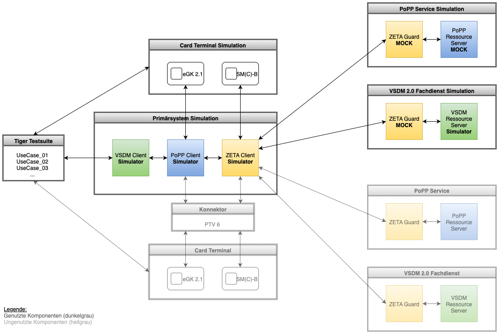

<br/>

# TI 2.0 Testhub

<details>
  <summary>Table of Contents</summary>
  <ol>
    <li><a href="#about-the-project">About The Project</a></li>
    <li><a href="#architecture">Architecture</a></li>
    <li><a href="#prerequisites">Prerequisites</a></li>
    <li><a href="#installation">Installation</a></li>
    <li><a href="#getting-started">Getting Started</a></li>
    <li><a href="#configuration">Configuration</a></li>
    <li><a href="#usage">Usage</a></li>
    <li><a href="#folder-structure">Folder Structure</a></li>
    <li><a href="#release-notes">Release Notes</a></li>
    <li><a href="#changelog">Changelog</a></li>
    <li><a href="#contributing">Contributing</a></li>
    <li><a href="#license">License</a></li>
    <li><a href="#additional-notes-and-disclaimer">Additional Notes and Disclaimer</a></li>
  </ol>
</details>

## About the Project

The **TI 2.0 Testhub** provides a comprehensive test environment for the modernized German Telematics Infrastructure (
TI) version 2.0. As the healthcare telematics infrastructure undergoes significant architectural improvements, a core
aspect is the implementation of **Zero Trust Architecture (ZeTA)** security concepts.

This project enables developers and testers to:

- **Simulate and validate** Zero Trust Architecture (ZeTA) components
- **Test PoPP** (Proof of Possession) workflows for secure authentication
- **Validate VSDM2** (Versichertenstammdatenmanagement 2.0) functionality
- **Develop and test** client applications against mock backend services
- **Understand integration patterns** for TI 2.0 ecosystem

### Key Components

The Testhub consists of several interconnected services:

**Client Services:**

- **VSDM Client SimService** - Simulates VSDM2 client operations
- **Card Terminal Client SimService** - Simulates electronic health card (eGK) terminal operations

**Server Services:**

- **VSDM Server SimService** - Provides VSDM2 data for testing
- **PoPP Server MockService** - Simulates Proof of Possession authentication server
- **ZeTA PDP Server MockService** - Policy Decision Point for Zero Trust Architecture
- **ZeTA PEP Server MockService** - Policy Enforcement Point proxy service

**Libraries:**

- **Card Client Library** - Reusable card terminal operations
- **PoPP Client Library** - PoPP authentication client functionality
- **VSDM FHIR Library** - FHIR resource handling for VSDM
- **ZeTA Client Library** - ZeTA integration utilities

All components are designed as mock/simulation services for development and testing purposes, **not for production use
**.

## Architecture

The Testhub implements a **Zero Trust Architecture** with multiple layers of services communicating through
authenticated channels.

### Component Overview (Stufe 1)

<br/>

### Service Descriptions

| Service                  | Port | Purpose                                                                                           | Documentation                                                |
|:-------------------------|:-----|:--------------------------------------------------------------------------------------------------|:-------------------------------------------------------------|
| **Card Terminal Client** | 8000 | Simulates electronic health card (eGK, SMC-B, HBA) terminal operations with PACE protocol support | [README](./client/card-terminal-client-simservice/README.md) |
| **VSDM Client**          | 8220 | Simulates VSDM2 client operations including data retrieval and PoPP token validation              | [README](./client/vsdm-client-simservice-java/README.md)     |
| **ZeTA PEP PoPP**        | 9110 | Policy Enforcement Point proxy for PoPP - validates tokens and forwards requests                  | [README](./server/zeta-pep-server-mockservice/README.md)     |
| **ZeTA PEP VSDM**        | 9111 | Policy Enforcement Point proxy for VSDM - validates tokens and forwards requests                  | [README](./server/zeta-pep-server-mockservice/README.md)     |
| **ZeTA PDP PoPP**        | 9100 | Policy Decision Point for PoPP - performs OAuth 2.0 token exchange (RFC 8693)                     | [README](./server/zeta-pdp-server-mockservice/README.md)     |
| **ZeTA PDP VSDM**        | 9101 | Policy Decision Point for VSDM - performs OAuth 2.0 token exchange (RFC 8693)                     | [README](./server/zeta-pdp-server-mockservice/README.md)     |
| **PoPP Server**          | 9120 | Backend PoPP service - generates and validates Proof of Possession tokens                         | [README](./server/popp-server-mockservice/README.md)         |
| **VSDM Server**          | 9121 | Backend VSDM service - provides VSDM2 data from YAML test fixtures                                | [README](./server/vsdm-server-simservice/README.md)          |

### References

**ZeTA**:

- [gemSpecPages ZeTA Documentation](https://gemspec.gematik.de/docs/gemSpec/gemSpec_Zero_Trust_Architecture/latest/)
- [ZeTA GitHub Repository](https://github.com/gematik/zeta)

**PoPP**:

- [gemSpecPages PoPP Prerelease Documentation](https://gemspec.gematik.de/prereleases/Draft_PoPP_25_1/gemSpec_PoPP_Service_V1.0.0_CC2/)
- [PoPP client GitHub Repository](https://github.com/gematik/spec-ilf-popp-client)
- [PoPP token generator GitHub Repository](https://github.com/gematik/popp-token-generator)

**VSDM2**:

- [gemSpecPages VSDM 2.0 Documentation](https://gemspec.gematik.de/docs/gemSpec/gemSpec_VSDM_2/latest/)
- [VSDM 2.0 GitHub Repository](https://github.com/gematik/spec-VSDM2/tree/main)
- [VSDM 2.0 FHIR Specification](https://simplifier.net/vsdm2/~introduction)

## Prerequisites

Before you begin, ensure you have the following installed on your system:

### Required Software

- **Java 21** - The project uses Java 21 as the language level
- **Maven 3.6 or higher** - Build tool for Java projects
- **Docker** - Container runtime for running services
- **Docker Compose** - Multi-container orchestration tool

### System Requirements

- **Operating System**: Linux, macOS, or Windows with WSL2
- **Memory**: Minimum 8GB RAM (16GB recommended for running all services)
- **Disk Space**: At least 10GB free space

### Verify Installation

Check your Java version:

```bash
java -version
```

Check your Maven version:

```bash
mvn -version
```

Check Docker and Docker Compose:

```bash
docker --version
docker compose version
```

## Installation

### 1. Clone the Repository

```bash
git clone <repository-url>
cd ti2.0-testhub
```

### 2. Build All Components

Build all Maven modules and run tests:

```bash
mvn clean install
```

This will:

- Build all client services
- Build all server services
- Build all library modules
- Run unit and integration tests
- Install artifacts in your local Maven repository (~/.m2)

**Build time:** Approximately 5-10 minutes depending on your system.

### 3. Build Docker Images

To create Docker images for all services, run maven install with activated docker profile:

```bash
mvn clean install -Pdocker
```

This will create Docker images for all components and tag them with `local/<component>:latest`.

**Images created:**

- `de.gematik.ti20.simsvc.client/card-terminal-client-simservice:local`
- `de.gematik.ti20.simsvc.client/vsdm-client-simservice:local`
- `de.gematik.ti20.simsvc.server/vsdm-server-simservice:local`
- `de.gematik.ti20.simsvc.server/popp-server-mockservice:local`
- `de.gematik.ti20.simsvc.server/zeta-pdp-server-mockservice:local`
- `de.gematik.ti20.simsvc.server/zeta-pep-server-mockservice:local`

To create only specific images, navigate to the respective module directory and run:

```bash
docker build .
```

## Getting Started

### Quick Start (All Services)

**Option 1: Start existing images**

```bash
./doc/bin/vsdm/docker-compose-local-restart.sh
```

**Option 2: Rebuild and start (recommended for first run)**

```bash
./doc/bin/vsdm/docker-compose-local-rebuild.sh
```

This will:

1. Build all Maven projects
2. Create Docker images
3. Start all services with Docker Compose

### Verify Services are Running

Check service health by accessing the status endpoints:

```bash
# Card Terminal Client
curl http://localhost:8000/service/status

# VSDM Client
curl http://localhost:8220/service/status

# ZeTA PEP PoPP
curl http://localhost:9110/service/status

# ZeTA PEP VSDM
curl http://localhost:9111/service/status

# ZeTA PDP PoPP
curl http://localhost:9100/service/status

# ZeTA PDP VSDM
curl http://localhost:9101/service/status

# PoPP Server
curl http://localhost:9120/service/status

# VSDM Server
curl http://localhost:9121/service/status
```

### Stop All Services

```bash
./doc/bin/vsdm/docker-compose-down.sh
```

## Configuration

### Environment Variables

Each service can be configured via environment variables. Key configuration options:

#### ZeTA PEP Services

- `PROXY_HTTP_URL` - Backend HTTP URL to proxy requests to
- `PROXY_WS_URL` - Backend WebSocket URL to proxy requests to
- `PROXY_POPP_REQUIRED` - Whether PoPP token validation is required (true/false)
- `WK_ISSUER` - OAuth 2.0 issuer URL
- `WK_AUTH_EP` - Authorization endpoint
- `WK_TOKEN_EP` - Token endpoint

#### ZeTA PDP Services

- `AUTHZ_SEC_STORE_PATH` - Path to PKCS12 keystore file
- `AUTHZ_SEC_STORE_PASS` - Keystore password
- `AUTHZ_SEC_KEY_ALIAS` - Key alias in keystore
- `AUTHZ_SEC_KEY_PASS` - Private key password

#### Client Services

- `POPP_HTTP_URL` - PoPP service HTTP URL
- `VSDM_RESOURCE_SERVER_URL` - VSDM service HTTP URL

### Docker Compose Profiles

The project uses different Docker Compose profiles for various scenarios:

**VSDM Test Setup** (default):

```bash
./doc/bin/vsdm/docker-compose-local-restart.sh
```

**PoPP Test Setup**:

```bash
docker compose -f doc/docker/vsdm/compose-local.yaml --profile popp up
```

### Custom Configuration

To customize service configuration:

1. Edit `doc/docker/vsdm/compose-local.yaml` for Docker Compose setup
2. Or create custom `application-<profile>.yaml` files in each service's `src/main/resources` directory

## Usage

### Running Tests

The Testhub includes a test suite for validating VSDM2 workflows:

```bash
cd test/vsdm-testsuite
mvn test
```

### Accessing Swagger UI

Most services expose Swagger UI for API exploration:

- **Card Terminal Client**: http://localhost:8000/swagger-ui/index.html
- **VSDM Client**: http://localhost:8220/swagger-ui/index.html
- **ZeTA PDP PoPP**: http://localhost:9100/swagger-ui/index.html
- **ZeTA PDP VSDM**: http://localhost:9101/swagger-ui/index.html
- **PoPP Server**: http://localhost:9120/swagger-ui/index.html
- **VSDM Server**: http://localhost:9121/swagger-ui/index.html

### Example Workflows

#### 1. VSDM Data Retrieval

```bash
# Get VSDM data through the client
curl -X GET 'http://localhost:8220/vsdm/data' \
  -H 'Authorization: Bearer <ACCESS_TOKEN>'
```

#### 2. Card Terminal Operations

```bash
# Load a card
curl -X POST 'http://localhost:8000/card/load' \
  -H 'Content-Type: application/json' \
  -d '{"cardPath": "cards/egk/valid-egk.xml"}'
```

#### 3. Token Exchange (OAuth 2.0 RFC 8693)

```bash
# Exchange SMC-B token for ZeTA token
curl -X POST 'http://localhost:9100/token' \
  -H 'Content-Type: application/x-www-form-urlencoded' \
  -d 'grant_type=urn:ietf:params:oauth:grant-type:token-exchange&subject_token=<SMC_B_TOKEN>&subject_token_type=urn:ietf:params:oauth:token-type:access_token'
```

### Debugging

All services support remote debugging on different ports:

- Card Terminal Client: Port 5005
- VSDM Client: Port 5006
- ZeTA PEP PoPP: Port 5007
- ZeTA PEP VSDM: Port 5008
- ZeTA PDP PoPP: Port 5001
- ZeTA PDP VSDM: Port 5002
- PoPP Server: Port 5003
- VSDM Server: Port 5004

Configure your IDE to connect to these ports for debugging.

## Folder Structure

This project has the following folders:

| Folder                              | Content                   | Description                               |
|:------------------------------------|:--------------------------|:------------------------------------------|
| **client/**                         | Client-side components    | Simulated client applications             |
| ├─ card-terminal-client-simservice/ |                           | Electronic health card terminal simulator |
| └─ vsdm-client-simservice-java/     |                           | VSDM2 client simulator                    |
| **server/**                         | Server-side components    | Backend services and proxies              |
| ├─ popp-server-mockservice/         |                           | PoPP token generation service             |
| ├─ vsdm-server-simservice/          |                           | VSDM2 data provider                       |
| ├─ zeta-pdp-server-mockservice/     |                           | Zero Trust Policy Decision Point          |
| └─ zeta-pep-server-mockservice/     |                           | Zero Trust Policy Enforcement Point       |
| **lib/**                            | Reusable libraries        | Shared functionality across services      |
| ├─ card-client-lib-java/            |                           | Card terminal operations library          |
| ├─ popp-client-lib-java/            |                           | PoPP authentication client library        |
| ├─ vsdm-fhir-lib-java/              |                           | FHIR resource handling for VSDM           |
| └─ zeta-client-lib-java/            |                           | ZeTA integration utilities                |
| **test/**                           | Test suites               | Integration and end-to-end tests          |
| └─ vsdm-testsuite/                  |                           | VSDM2 workflow test suite                 |
| **doc/**                            | Documentation and scripts | Build and deployment automation           |
| ├─ bin/vsdm/                        |                           | Build and Docker Compose scripts          |
| ├─ docker/vsdm/                     |                           | Docker Compose configuration              |
| └─ k8s/                             |                           | Kubernetes deployment manifests           |
| **images/**                         | Static assets             | Images for README documentation           |
| **jenkinsfiles/**                   | CI/CD pipelines           | Jenkins pipeline definitions              |

## Release Notes

See [ReleaseNotes.md](./ReleaseNotes.md) for all information regarding the (latest) releases.

## Changelog

See [CHANGELOG.md](./CHANGELOG.md) for information about changes.

## Contributing

If you want to contribute, please check our [CONTRIBUTING.md](./CONTRIBUTING.md).

## License

Copyright 2025 gematik GmbH

Apache License, Version 2.0

See the [LICENSE](./LICENSE) for the specific language governing permissions and limitations under the License.

## Additional Notes and Disclaimer from gematik GmbH

1. Copyright notice: Each published work result is accompanied by an explicit statement of the license conditions for
   use. These are regularly typical conditions in connection with open source or free software. Programs
   described/provided/linked here are free software, unless otherwise stated.
2. Permission notice: Permission is hereby granted, free of charge, to any person obtaining a copy of this software and
   associated documentation files (the "Software"), to deal in the Software without restriction, including without
   limitation the rights to use, copy, modify, merge, publish, distribute, sublicense, and/or sell copies of the
   Software, and to permit persons to whom the Software is furnished to do so, subject to the following conditions:
    1. The copyright notice (Item 1) and the permission notice (Item 2) shall be included in all copies or substantial
       portions of the Software.
    2. The software is provided "as is" without warranty of any kind, either express or implied, including, but not
       limited to, the warranties of fitness for a particular purpose, merchantability, and/or non-infringement. The
       authors or copyright holders shall not be liable in any manner whatsoever for any damages or other claims arising
       from, out of or in connection with the software or the use or other dealings with the software, whether in an
       action of contract, tort, or otherwise.
    3. The software is the result of research and development activities, therefore not necessarily quality assured and
       without the character of a liable product. For this reason, gematik does not provide any support or other user
       assistance (unless otherwise stated in individual cases and without justification of a legal obligation).
       Furthermore, there is no claim to further development and adaptation of the results to a more current state of
       the art.
3. Gematik may remove published results temporarily or permanently from the place of publication at any time without
   prior notice or justification.
4. Please note: Parts of this code may have been generated using AI-supported technology. Please take this into account,
   especially when troubleshooting, for security analyses and possible adjustments.
