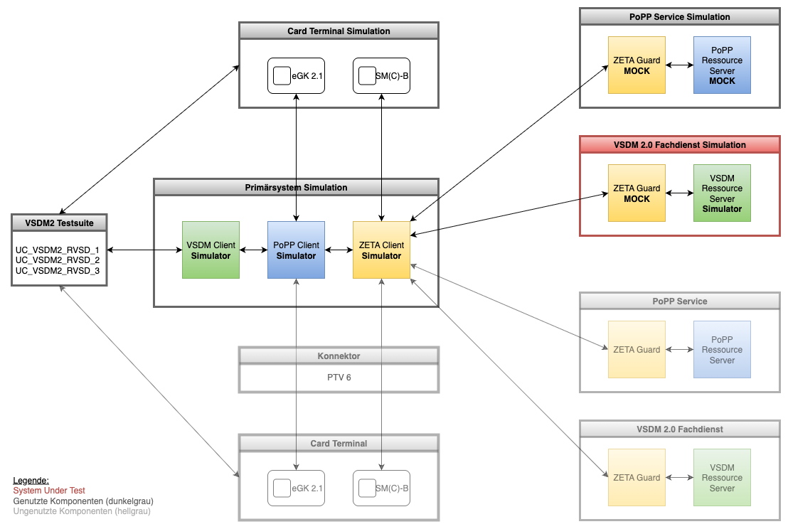

<br/>

<br/>

# VSDM 2.0 Testsuite

## Einleitung

Die vorliegende Testsuite beinhaltet verschiedene E2E- und IT-Tests, welche die Funktionen des Fachdienstes VSDM 2.0
prüfen und sich an der gematik Spezifikation für den Fachdienst VSDM 2.0 (gemSpec_VSDM_2) orientieren. Die Testfälle
sind mittels Gherkin beschrieben und werden durch das Cucumber und Serenity-Framework zur Ausführung gebracht.
Zusätzlich wird das Tiger-Framework der gematik zur Visualisierung und Auswertung der Tests verwendet.

Weiterhin bietet die VSDM 2.0 Testsuite eine Lastsimulation basierend auf Gatling an. Diese Simulation kann je nach
Konfiguration verschiedene Laststufen und Lastkurven (linear, nicht-linear) generieren. Die Konfiguration für die
Simulation orientiert sich an den Vorgaben der gematik Performance-Spezifikation (gemSpec_Perf), d.h. die Maximallast
beträgt 1.000 Calls/sec und die maximale Antwortzeit liegt bei 1.000 msecs.

## Vorbedingungen

Alle Tests der VSDM 2.0 Testsuite verwenden aktuell die simulierten Dienste des TI 2.0 TestHubs. Dieser besteht aus
den folgenden Komponenten:

* Card Client Simulator
* ZETA Client Simulator
* PoPP Client Simulator
* VSDM Client Simulator
* ZETA PDP Server Simulator (ZETA Guard)
* ZETA PEP Server Simulator (ZETA Guard)
* PoPP Server Mock (PoPP Token Generator)
* VSDM Server Simulator

Sämtliche Tests der VSDM-Testsuite setzen diese simulierten Dienste voraus. Diese können mit folgendem Skript-Aufruf als
Docker-Container gestartet werden: (Der Skript-Aufruf sollte im Projekt-Root-Verzeichnis erfolgen.)

```
./doc/bin/vsdm/docker-compose-local-rebuild.sh
```

Das obige Skript kennt die folgenden Parameter:

* -h --help --> Anzeige der Hilfe
* -d --dry-run --> Anzeige der Befehle
* -s --skip-tests --> Alle Tests überspringen
* -p --projects LIST --> Auswahl einzelner Projekte

Die untere Grafik zeigt den TI 2.0 TestHub in seiner ersten Ausbaustufe, welche ausschließlich aus Simulatoren bzw.
Mocks besteht. Die VSDM 2.0 Testsuite sendet Anfragen an den Card, den PoPP und den VSDM Client Simulator. Diese
kommunizieren mit den jeweiligen Server Simulatoren bzw. Mocks.

<br/>

<br/>

## Integrationstests

Die Testsuite enthält zwei Integrationstests (IT), welche die Funktionen der VSDM Client und Server Simulationen prüfen
und somit deren Funktionsweise demonstrieren. Die Tests verwenden das Jupiter-Framework von jUnit 5. Testfälle:

* VsdmClientIT.java
* VsdmServerIT.java

Die Integrationstests können mit folgender Kommandozeile im Verzeichnis 'vsdm-testsuite' gestartet werden:

```
mvn -Dit.test="Vsdm*IT" -Dskip.inttests=false verify
```

## E2E-Tests

Die Testsuite beinhaltet vier E2E-Testfälle, welche die Abfrage der Versichertenstammdaten (VSD) vom Fachdienst VSDM 2.0
als Testziel haben. Zwei Testfälle behandeln den Normalfall, wenn der Fachdienst verfügbar ist und dem Primärsystem (PS)
antwortet. Der Fachdienst liefert die VSD aus, wenn sich das sogenannte Entity-Tag (E-Tag), das vom PS gesendet wird,
vom E-Tag des Fachdienstes unterscheidet. Liefert der Vergleich keinen Unterschied, sendet der Fachdienst keine VSD an
das PS. Testfälle:

* UC_VSDM2_RVSD_FROM_SERVER_WITH_UPDATE.feature (E-Tag ungleich)
* UC_VSDM2_RVSD_FROM_SERVER_WITHOUT_UPDATE.feature (E-Tag gleich)

Zwei weitere Testfälle behandeln den Ausnahmefall, dass der Fachdienst nicht verfügbar ist oder dem PS mit einem Fehler
antwortet. In diesem Fall liest das PS die wichtigsten VSD von der eGK direkt. Auch hier werden zwei unterschiedliche
Szenarien getestet. In einem Szenario können die VSD erfolgreich von der eGK gelesen werden, im anderen Szenario ist
dies nicht möglich, da die eGK ungültig ist. Testfälle:

* UC_VSDM2_RVSD_FROM_EGK_CARD_VALID.feature
* UC_VSDM2_RVSD_FROM_EGK_CARD_INVALID.feature

Die E2E-Tests können mit folgender Kommandozeile im Verzeichnis 'vsdm-testsuite' gestartet werden:

```
mvn clean verify -Dcucumber.filter.tags="@TYPE:E2E" -Dskip.inttests=false
```

## Lasttests

Die VSDM 2.0 Testsuite enthält aktuell vier Lasttests, welche die Antwortzeiten der VSDM 2.0 Server Simulation prüfen.
Hierbei werden die beiden Varianten Antwort HTTP Code 200 mit VSD und HTTP Code 304 ohne VSD sowie einzelne und
mehrfache Anfragen getestet. Die Antwortzeit des Servers darf in allen Fällen nicht größer als 1.000 msecs sein.
Testfälle:

* UC_VSDM2_RVSD_LOAD_SINGLE_WITH_UPDATE.feature
* UC_VSDM2_RVSD_LOAD_SINGLE_WITHOUT_UPDATE.feature
* UC_VSDM2_RVSD_LOAD_MULTI_WITH_UPDATE.feature
* UC_VSDM2_RVSD_LOAD_MULTI_WITHOUT_UPDATE.feature

Die Lasttests können mit folgender Kommandozeile im Verzeichnis 'vsdm-testsuite' gestartet werden:

```
mvn clean verify -Dcucumber.filter.tags="@TYPE:LOAD" -Dskip.inttests=false
```

## Gatling-Simulationen

Die VSDM 2.0 Testsuite enthält mehrere Lasttest-Simulationen basierend auf Gatling, welche sich im Ablauf unterscheiden
und für unterschiedliche Zwecke einsetzbar sind.

### GeneratePoppTokenSimulation.java

Diese Simulation liest eine Liste von IK- und KVNR ein und generiert dann mithilfe des PoppTokenGenerators eine Liste
aus
Popp-Token. Diese Liste kann dann später als Feeder für die Simulation der Hintergrundlast verwendet werden. Die
Simulation
kann mittels Maven und folgender Kommandozeile im Verzeichnis 'vsdm-testsuite' gestartet werden:

```
mvn gatling:test -Dgatling.simulationClass=de.gematik.ti20.vsdm.test.load.GeneratePoppTokenSimulation
```

### PoppVsdmServerSimulation.java

Diese Simulation ruft zuerst den PoppTokenGenerator mit einer Kombination aus IK- und KVNR auf, welcher einen gültigen
Popp-Token zurückliefert. Danach wird dieser Popp-Token während der Abfrage der VSD vom VsdmServerSimulator verwendet.
Die Simulation kann mittels Maven und folgender Kommandozeile im Verzeichnis 'vsdm-testsuite' gestartet werden:

```
mvn gatling:test -Dgatling.simulationClass=de.gematik.ti20.vsdm.test.load.PoppVsdmServerSimulation [-DrandomReadVsd=true]
```

### VsdmClientJourneySimulation.java

Diese Simulation simuliert den kompletten Ablauf vom Einstecken der Karten, über die Erlangung des Versorgungskontextes
bis hin zur Abfrage der VSD vom Fachdienst VSDM 2.0 und kann im Verzeichnis 'vsdm-testsuite' wie folgt gestartet werden:

```
mvn gatling:test -Dgatling.simulationClass=de.gematik.ti20.vsdm.test.load.VsdmClientJourneySimulation [-DrandomReadVsd=true]
```

### VsdmBackgroundLoadSimulation.java

Diese Simulation verwendet die, von der GeneratePoppTokenSimulation erzeugte, Liste aus Popp-Token, fragt die VSD vom
VsdmServerSimulator ab und wird in Verbindung mit den Lasttests zur Generierung der Hintergrundlast eingesetzt.
Die Simulation kann mittels Maven und folgender Kommandozeile im Verzeichnis 'vsdm-testsuite' gestartet werden:

```
mvn gatling:test -Dgatling.simulationClass=de.gematik.ti20.vsdm.test.load.VsdmBackgroundLoadSimulation [-DrandomReadVsd=true]
```

Die Hintergrundlast ist aktuell in der Datei "BaseSimulation.java" so konfiguriert, dass diese maximal 25 Aufrufe in
der Sekunde über einen Zeitraum von ca. fünf Minuten versendet. Das Versenden kann mit dem Parameter "randomReadVsd"
gleichförmig oder variabel erfolgen. Bei Auswahl einer variablen Hintergrundlast bewegen sich die Aufrufe zufällig
zwischen den Werten 5 bis 25 Aufrufe pro Sekunde. Natürlich können die aktuell eingestellten Parameter durch passende
System-Parameter (Option -D) überschrieben werden.

### Beispiel: Gleichförmige Hintergrundlast (25 Aufrufe/sec für 60 Sekunden)

* randomReadVsd=false
* usersPerSec=25
* usersDurationSecs=60

### Beispiel: Variable Hintergrundlast (5-25 Aufrufe/sec für 300 Sekunden)

* randomReadVsd=true
* readVsdPerSecMin=5
* readVsdPerSecMax=25
* readVsdDurationSecs=30
* readVsdNumberCycles=10

## Hinweise

In der aktuellen Ausbaustufe sind die ZETA-Komponenten nur als Mocks implementiert und sollen zeitnah durch die realen
Komponenten ersetzt werden. Daher enthalten die Testschritte zur Authentifizierung am ZETA Guard keine Implementierung.

Die PoPP-Komponenten sind ebenfalls nur als Mocks ausgeführt und sollen zeitnah durch eine Beispiel-Implementierung
ersetzt werden. Gegenwärtig generiert der PoPP-Server-Mock nur einen PoPP-Token basierend auf der IK- und KV-Nummer.
