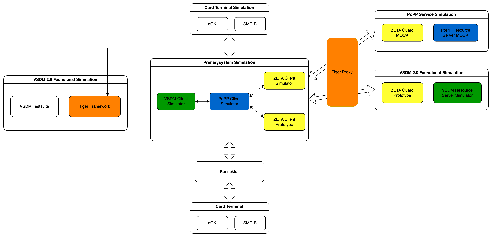

== Architecture

Testhub combines ZETA components with Telematik Infrastructure components like
VSDM and PoPP. While the ZETA components are the real software artifacts from
official channels, their configuration usually references mock certificates.

The idea of the setup is to mix and match. Some possible scenarios to use
Testhub:

* combine Testhub's mock implementations with your own VSDM server for testing
* run the server parts and test your own ZETA client implementation

NOTE: Testhub is intended for development and testing purposes, **not for
production use**.

=== Component Overview (Stufe 2)



=== Service Descriptions

|===
| Service                  |  Purpose

| **Card Terminal Client** |  Simulates electronic health card (eGK, SMC-B, HBA) terminal operations with PACE protocol support
| **VSDM Client**          | Simulates VSDM2 client operations including data retrieval and PoPP token validation
| **ZETA PEP PoPP**        |  Policy Enforcement Point proxy for PoPP validates tokens and forwards requests
| **ZETA PDP PoPP**        |  Policy Decision Point for PoPP performs OAuth 2.0 token exchange (RFC 8693)
| **PoPP Server**          |  Backend PoPP service generates and validates Proof of Possession tokens
| **VSDM Server**          |  Backend VSDM service provides VSDM2 data from YAML test fixtures
| **Tiger Proxy UI**       |  Local Tiger Proxy between PS-Simulation and PoPP and VSDM-Servers
|===

The services are exposed on different ports to the local environment. To access
the containers when applicable, use the following script to find the host port
mapping:

```bash
docker ps --format 'table {{.Names}}\t{{.Ports}}'
```

=== References

**ZETA**

* link:https://gemspec.gematik.de/docs/gemSpec/gemSpec_ZETA/latest/[ZETA Specification]
* link:https://gematik.github.io/zeta/[ZETA SDK User Manual]
* link:https://github.com/gematik/zeta[ZETA GitHub Repository]
* link:https://gemspec.gematik.de/docs/gemILF/gemILF_ZETA_API/latest/[Implementation Guide ZETA Client]

**PoPP**

* link:https://gemspec.gematik.de/docs/gemSpec/gemSpec_PoPP_Service/latest/[gemSpecPages PoPP-Service Release Documentation]
* link:https://github.com/gematik/spec-ilf-popp-client/tree/main[PoPP-Client Implementation Guide GitHub Repository]
* link:https://github.com/gematik/popp-sample-code[PoPP-Sample Implementation GitHub Repository]
* link:https://github.com/gematik/popp-token-generator[PoPP token generator GitHub Repository]

**VSDM2**

* link:https://gemspec.gematik.de/docs/gemSpec/gemSpec_VSDM_2/latest/[gemSpecPages VSDM 2.0 Documentation]
* link:https://github.com/gematik/spec-VSDM2/tree/main[VSDM 2.0 GitHub Repository]
* link:https://simplifier.net/vsdm2/~introduction[VSDM 2.0 FHIR Specification]
